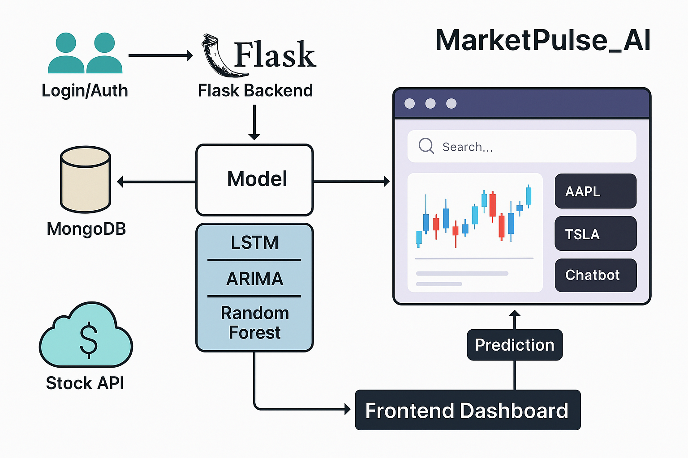
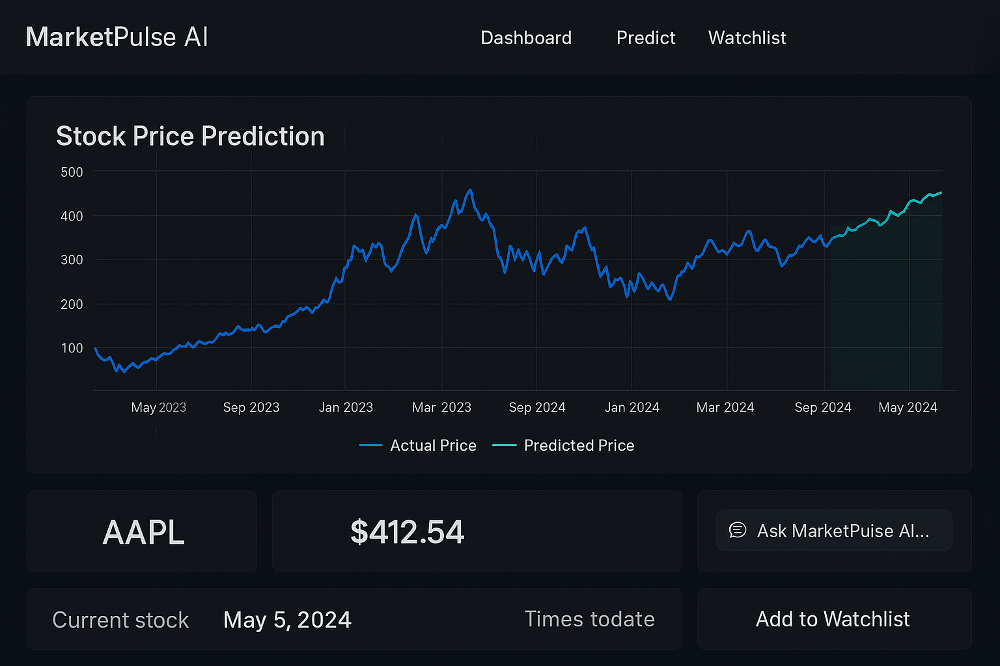

# 📊 MarketPulse AI

**MarketPulse AI** is a real-time stock analysis and prediction web application designed for both novice and intermediate investors. Built with modern full-stack technologies, it forecasts next-day stock prices using advanced ML and DL models, and delivers insightful visualizations and intelligent tools to enhance decision-making in trading.

---

## 🌍 Theme & Objective

**Theme:** Science and Technology for Sustainable Future  
**Sub-theme:** Mathematical Modeling and Computational Thinking

**Problem Statement:**  
Stock market volatility often discourages new investors. MarketPulse AI addresses this by using machine learning and historical data to predict trends, empowering users with actionable insights and promoting financial sustainability.

---

## 🚀 What It Does

MarketPulse AI combines multiple data sources and prediction models to provide:

- 🔐 **Secure Authentication** — Log in to a personalized dashboard.
- 📈 **Real-time Stock Ticker Tape** — Live market trends using ticker data.
- 🔍 **Search with Suggestions** — Search any company and retrieve ticker data.
- 📊 **Candlestick & Line Charts** — Visualize open, close, high, and low for any ticker.
- 🧠 **ML & DL-Based Predictions** — Use ARIMA, Random Forest, LSTM, BiLSTM to forecast future stock prices.
- 💬 **Chatbot** — Preprompted assistant for investment-related queries.
- ⭐ **Watchlist** — Add/remove stocks to monitor personalized tickers.
- 🧾 **Company Insights** — Summary of each searched stock’s performance.

---

## 🌟 Key Features

- ✅ Realtime Stock Market Visualization  
- ✅ Personalized Watchlist & Dashboard  
- ✅ AI-Powered Chatbot with Stock Context  
- ✅ Multi-model Predictions: LSTM, ARIMA, Random Forest  
- ✅ MongoDB Integrated Feedback System  
- ✅ Dark Mode Support  
- ✅ Candlestick + Indicator Graphs  
- ✅ Responsive UI with Shadcn & Tailwind

---

## 🛠️ Tech Stack

**Frontend**  
- React.js with TypeScript  
- Tailwind CSS  
- Shadcn UI components  

**Backend**  
- Flask (Python)

**Database**  
- MongoDB

**APIs**  
- Yahoo Finance (`yfinance`)  
- Gemini

---

## 🧱 Architecture

The client (Vite + React) interfaces with the Flask server to fetch predicted data. Models (LSTM, ARIMA, etc.) run backend forecasts, while MongoDB stores user interactions and preferences.

---

## 💻 Dashboard Preview

---

## 📂 File Structure & Installation

- `client/` – React frontend  
- `server/` – Flask backend and APIs  
- `prediction/` – DL & ML models and utilities  
- `docs/` – Documentation and visuals  

See [FILE_STRUCTURE.md](FILE_STRUCTURE.md) and [INSTALLATION.md](INSTALLATION.md) for setup instructions.

---

## ▶️ Live Demo

**Coming Soon**  
Deployed via **Vercel (Client)** and **Render (Server)**

---

## 📜 License

This project is licensed under the Apache 2.0 License – see the [LICENSE](LICENSE) file for details.

---

_Last updated: April 06, 2025_
